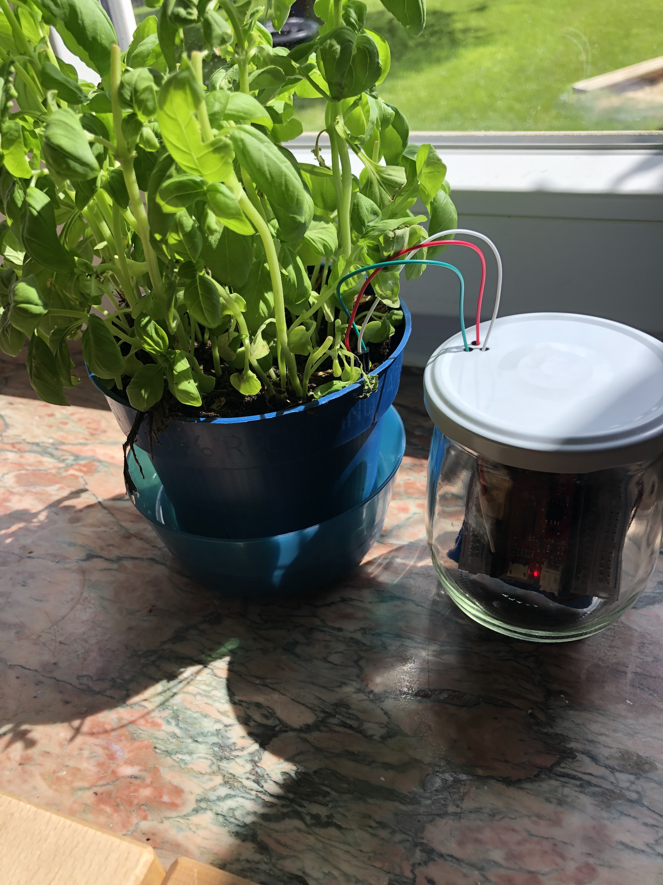

# nodigFirmware-esp32: Firmware for an ESP32 to Observe Vegetable Beds

Authors: Simon Bogutzky

License: [MIT](https://opensource.org/licenses/MIT)

Version: 1.3.1

Document version: 1.0.0 

Date: 31/05/2020 

## What is the nodig Firmware?
The nodig firmware is developed for a ESP32 microcontroller e.g. [SparkFun ESP32 Thing](https://www.sparkfun.com/products/13907). It monitors soil moisture, air humidity and temperature of vegetable beds by means of a soil moisture sensor [SparkFun Soil Moisture Sensor](https://www.sparkfun.com/products/13637) and a temperature sensor and humidity sensor [DHT22 AM2302](https://www.az-delivery.de/products/dht22). The software transfers the collected data to the backend [nodig backend](https://github.com/sbogutzky/nodig-backend/) via a REST API.

*Vegetable Beds*

*Test Plant*

## Author and Contribution
As expressed by license, this is free software published by Simon Bogutzky. The author (Simon Bogutzky) welcomes external contributors to freely use and extend this software. If you need help, please write an [issue](https://github.com/sbogutzky/nodigFirmware-esp32/issues).